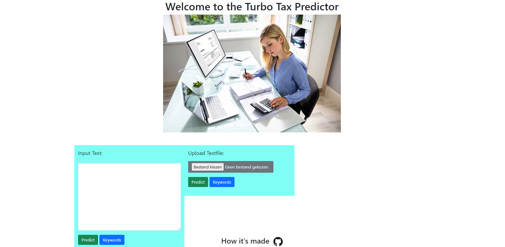

# NLP-assignment


## Desciption

This is a web app that uses NLP to classify documents from the [*Belgische Staatblad*](https://www.ejustice.just.fgov.be/cgi/summary.pl)

## Usage 

A live version can be found [here](https://tax-predict.herokuapp.com/)




## Installation

Install the required packages.

```bash
pip install -r project/requirements.txt
```

This script will scrape documents to use and generate & save the keywords. This needs to be done at least once before hosting the app locally or in docker. (This can take a while depending on your PC's specs)
```bash
python main.py
```

Host the app locally, it will be running on [localhost](http://localhost:5000/)

```bash
python app.py
```

### Docker

Build the docker image
```bash
docker build . -t tax-predict
```

Deploy the docker image to a container and run locally.
App will be running on [localhost](http://localhost:5000/)

```bash
docker run -d -p 5000:5000 tax-predict
```


## Information

## The different lawtexts where scraped from the official website of the Belgian State.
We used a notebook that can be found under directory 'notebook'
(scrape_staatsblad.ipynb or Scrape.ipynb)
For this project we where limited and used only the provided links to these lawtexts.

##
## Description of the functions for notebook KPMG_analyse.ipynb
## -----------------------------------------------------------------------

Before integrating the functions into our application we created and tested them out in a notebook environment.
Hereafter is an explaination of the different functions that are present in this notebook.
The notebook can be found under directory 'notebook'.


### Function nlp_cleanandlemmatize
	This function will clean a text and lemmatize it , it returns a dictionary off all words and a list of all tokens, only 'NOUNS' are kept.

### Function token_compare
	Compare a token against a list of tokens and using a treshold return tokens that have a similarity score higher then this treshold.

### Function createlistofkeywords
	Discover new keywords using some initial starting keywords, return the expanded list of keywords.
    
### Function create_pickle_keywords_and_docscores
	Discover and save a keyword list and a document score list.  

### Function score_text
	Using list of keywords score of how related a document is to these keywords by using similarity.

### Function create_initial_keywordlist
	Create the initial keyword list and save it.
 
### Function get_keywordsunsupervised
	Discover keywords that have the most similarity towards the textcontent unsupervised keyword search.

### Function score_topic_list
	Calculate a score for a list of keywords towards a text.

### Function score_text_byvector
	Score a document using similarity of a document vector and the kyword list vector.


### Function get_topic_byvector
	This function predicts the main topic in a dcoument by using a list of topic keywords.
	For now we have following topics:   
                            ['inkomstenbelasting'],
                            ['personenbelasting'],
                            ['vennootschapsbelasting'],
                            ['rechtspersonenbelasting'],
                            ['belasting van niet-inwoners'],
                            ['belasting op de toegevoegde waarde'],
                            ['internationale belastingrecht'],
                            ['registratierechten'],
                            ['successierechten'],
                            ['douanerechten'],
                            ['verkeersbelasting'],
                            ['loonbelasting'],
                            ['dividendbelasting'],
                            ['erfbelasting'],
                            ['schenkbelasting'],
                            ['kansspelbelasting'],
                            ['gokbelasting'],
                            ['vermogensrendementsheffing']
                            

	The topics are lists that contain one or more related keywords to the topic.
	

### Example usage of get_topic_byvector
### Example usage of get score for one txt string
### example usage of unsupervised keyword discovery


## Contacts:
Name: Bouazzaoui Mohammed
	Linkedin: https://www.linkedin.com/in/mbouazzaoui/
	email:bzzmo@hotmail.com
